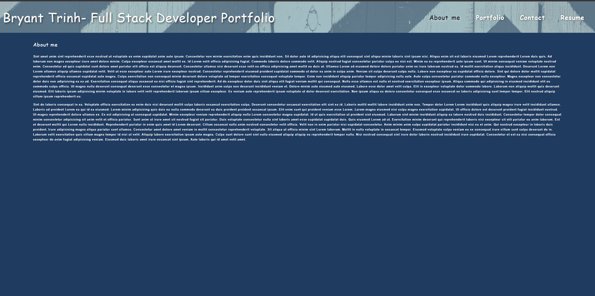

# REACT - Portfolio

## Description

I created a portfolio using REACT, so that I am able to easily update content.

## Installation

First clone the repository, run "npm i" in the integrated terminal to download dependencies, and then run "npm run start" to use this portfolio.

## Usage

 

## Credits

Bryant Trinh

## License

No license 

## How to Contribute

Anyone can contribute to this.
